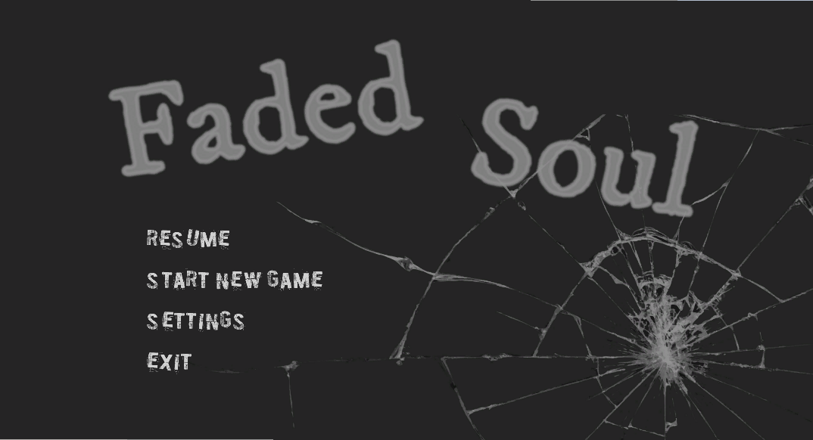

# Game Design Document

This is a placeholder for the GDD. Your team should replace the content of this
file with your own GDD from project 1, and continue to maintain it as discussed
in the project specification. 

Please **do not** update the repository from project 1, all updates to the GDD
going forward should be made to this file. **Make sure that you keep this file
named `GDD.md` and don't move it from the root directory of the repository.**

# Faded Soul Design Document

## Table of contents
* [Game Overview](#game-overview)
* [Story and Narrative](#story-and-narrative)
* [Gameplay and Mechanics](#gameplay-and-mechanics)
* [Levels and World Design](#levels-and-world-design)
* [Art and Audio](#art-and-audio)
* [User Interface (UI)](#user-interface)
* [Technology and Tools](#technology-and-tools)
* [Development Team](#development-team)

## Game Overview

### Core Concept
The core concept of the game revolves around a journey to save the soul of a young girl. After enduring severe bullying in society, she attempts suicide but survives, falling into a coma. Players control her soul through various challenging situations, guiding it past dangers and back to her comatose body. Each environment reflects a traumatic experience, with obstacles and enemies symbolizing emotional scars. The player’s goal is to help the soul overcome these challenges, allowing the character to confront her past and become more whole. In the final scene, the player will guide the soul in deciding whether to return to the girl’s body, reawakening her to face reality again, or remain in eternal slumber.
### Related genre(s)
This game is a 2.5D runner and platformer game, combining emotional fear with eerie and spooky elements. Similar games might include "Limbo" and "Inside". This game differentiates itself by focusing on emotional depth and the exploration of mental health themes. Each level is designed to challenge the player's response to obstacles and provoke thought and emotional reflection on different psychological traumas.
### Target Audience
This game targets players who enjoy narrative-driven experiences with emotional depth and explore complex themes. The target demographic includes adults aged 18-35 who appreciate games like "Limbo" and "Inside" and who are interested in stories about personal growth. It will resonate with players who looking for meaningful gaming experiences that go beyond entertainment and touch on real-life psychological issues.
### Unique Selling Points (USPs)
* Each level represents a different psychological trauma, creating a unique blend of storytelling and gameplay. The game is designed to allow players to understand the story of the main character gradually. 
* This 2.5D game combines the depth of 3D environments with the simplicity of 2D gameplay. The game will use shadows, light, and symbolic props to show the story.
* The obstacles in the game not only serve as physical challenges but also represent the fears and memories the main character has faced in the past. Players can interact with these symbolic props to illuminate the game screen, adjust the character's size, change speeds, and attempt to avoid obstacles or traps to progress to the next level.
* As the player completes each level, the main character's appearance gradually transforms into a more defined shape, symbolizing their journey toward saving the soul.

## Story and Narrative
### Backstory
The game is set in an eerie, fragmented world with haunting elements, reflecting the lost and damaged soul of the main character following deep emotional trauma. Since childhood, she has endured bullying across various settings—school, online, and in the workplace—leading her to attempt suicide, though she survives and falls into a coma. Each level represents a different painful memory she has experienced, with players facing various obstacles and traps to progress. The primary goal is for players to experience what the girl went through, understand why she made the choice to end her life, and help her soul decide whether to return to the real world. As players advance, they uncover more of the main character’s memories, each level symbolizing a specific difficult period, such as school bullying, cyberbullying, or workplace harassment. The story gradually unfolds through environmental storytelling.
### Characters
**Main character:** The main character is a young girl in a long dress. She starts as a blurry figure, representing her faded soul, and gradually becomes more defined as she progresses through each level. Her motivation is to overcome past psychological trauma, heal her spirit, and ultimately save her soul. Her personality is quiet and introspective, shaped by her traumatic experiences. After each level, her physical form and light color will change, reflecting her emotional healing.

<a href="https://assetstore.unity.com/packages/3d/characters/humanoids/humans/anime-girl-character-akane-214048">A model from Assetstore</a></td> is used and modified as the main character of this game. The figure is as follows:

  
  

Characters Side Views

**Enemies/Monsters:** TThese monsters will be in the form of animated items that represent different psychological traumas the character faced in the past. For instance:

1. School Bullying
  * Running Water Bucket: The bucket chases the player, symbolizing the anxiety of being pursued by bullies.
  * Pile of Chairs: This pile blocks the player’s path, representing how classmates once trapped her in the classroom.
  * Flying Pen Holder: Pen holders suddenly shoot out from a cabinet, symbolizing how classmates once threw pen holders at her.
2. Cyberbullying
  * Anonymous Masks: These masks block the player’s path, representing anonymous online attackers.
  * Pop-up Insults: Harmful comments and text bubbles that appear to obstruct the player, symbolizing the negativity encountered online.
  * Rolling Binary Code: Streams of chaotic online content that confuse and overwhelm the player, symbolizing the disorientation caused by the digital world.
3. Workplace Harassment
  * Coworkers watching indifferently: represents how colleagues remain cold and unhelpful when witnessing workplace bullying.
  * Paper-Shooting Printer: Represents the overwhelming workload she faced daily.
  * Stacks of Documents: Symbolize the crushing burden of constant tasks and responsibilities.
  * Timed Bomb: Forces the player to rush through sections, representing the stress of deadlines and intense time pressure.

## Gameplay and Mechanics
### Player Perspective: 
The game is designed to use a third-person perspective, with a fixed camera that keeps the player-controlled character always visible and centered on the screen. As the game progresses, the character will gradually change shape—starting as an almost transparent figure, then transforming into a clearly outlined gray humanoid, and finally becoming a fully colored humanoid figure.
### Controls: 
The game uses the "A/D" or "left/right" keys as the default controls for character movement; the space bar controls jumping; the Shift key enables the character to speed up and run; and the Enter key brings up the menu and pauses the game. The specific controls are shown below:

  

Game control button

### Progression: 
This game setup consists of three consecutive levels that the player must complete in order. Players need to touch candles to keep the game scene illuminated and avoid various traps and obstacles as they progress. The difficulty of each level increases over time, requiring greater precision and agility to control the character. If the player steps on a trap or hits an obstacle, the character either dies or slows down. Players must jump to touch candles as they move toward the main objective; otherwise, the screen will gradually darken, making it harder to maneuver around obstacles. Collected lightning bolts can also enhance the character's athletic abilities, such as increasing running speed.
### Gameplay Mechanics: 
The main game mechanics involve players controlling the character to avoid obstacles and collect items, ultimately reaching the end of the level. The core rule of the game is to collect items and avoid traps, ensuring the character can reach the goal safely. We plan to set the three levels as "School Bullying", "Cyberbullying", and "Workplace Harassment" respectively.
## Levels and World Design
### Game World:
The game world is set in the virtual soul world of the main character, where past bullies reappear, and the player must control the character to avoid obstacles, collect items, and ultimately end the nightmare by overcoming her fears.

The entire game interface is in 2.5D with a scrolling screen that moves as the player controls the main character. The game has three levels: "School Bullying," "Cyberbullying," and "Workplace Harassment." A speed indicator is displayed in the upper left corner of the screen to show the player's current speed.
### Objects:
Objects in the game include the main character controlled by the player, collectible items, auxiliary items to overcome obstacles, obstacles and traps, monsters, and game backgrounds. Among them:

The main character is a young girl in a long dress, viewed from a third-person perspective. The player controls her using the "left" and "right" keys or "A" and "D" on the keyboard to avoid attacks, traps, and obstacles in the scene while collecting various items to assist in progressing through the level.

Monsters are enemies that the player must face in the game world, which can be divided into two categories: those that appear in specific locations and actively pursue and attack the protagonist, and "sleeping monsters," which disguise themselves as other obstacles. While they do not actively chase or attack the protagonist, if the player accidentally encounters them, they will attack.

Other objects are immobile, including:
  * Items: These appear along the player’s path to the main objective, do not move, and can assist the player in progressing. The first type is candles, which the player can jump to touch to illuminate the game scene; otherwise, the screen will gradually darken, making it difficult to see the obstacles ahead. Another type is lightning, which the player can collect while passing by to gain speed.
  * Game Background: This represents the virtual world of the soul. Different levels feature different game backgrounds, and as the protagonist progresses through a level, the background will change. The player must control the protagonist to navigate through this environment and ultimately reach the end.
### Physics:
Although the game is set in a virtual world, the physical elements closely resemble those of the real world and follow the same physical laws, such as gravity and Newton's laws of motion. For example, falling from a high place can cause death, the character cannot pass straight through obstacles when colliding with other objects, and the character moves more slowly when hit by an object.

## Art and Audio

### Art Style
The game features a dark art style that emphasizes atmosphere and emotion. The visual design is inspired by games like *Limbo* and *Inside*, characterized by a strong use of shadows and silhouettes. The color palette is dominated by shades of black and gray, and the shapes in the game are simple and geometric. The protagonist starts as an almost transparent figure and gradually becomes more defined and detailed. Textures focus on smooth, flat surfaces that enhance the game’s eerie atmosphere. Overall, the aesthetic of the game conveys desolation and isolation, with environments that feel oppressive and haunting. The use of negative space and lighting is crucial, with deep shadows creating a sense of depth and mystery.

<table>
  <tr>
    <th style="width: 20%;">Name&nbsp;and&nbsp;Link</th>
    <th style="width: 30%;">Image</th>
    <th style="width: 50%;">Description</th>
  </tr>
  <tr>
    <td align="center"><a href="https://store.steampowered.com/app/48000/LIMBO">LIMBO</a></td>
    <td align="center"></td>
    <td>LIMBO is a 2D side-scrolling puzzle adventure game focusing on puzzle solving and platform jumping. It uses minimalist black and white tones and shadow effects to create an atmosphere of repression and mystery. We drew inspiration from its art style.</td>
  </tr>
  <tr>
    <td align="center"><a href="https://store.steampowered.com/app/304430/INSIDE">INSIDE</a></td>
    <td align="center"></td>
    <td>INSIDE continues LIMBO's dark style, with bleak tones and a heavy atmosphere. We were inspired by its unique artistic style and atmosphere shaping.</td>
  </tr>
</table>

### Sound and Music
The game uses eerie background music to enhance immersion. The soundtrack focuses on creating mood, featuring melancholic piano or string compositions that evolve as the protagonist progresses through the levels. Each level has its own theme, with music that reflects the specific emotional tone of the trauma being explored. The audio dynamically changes based on the player’s actions and the game’s narrative progression. Please refer to the table below for specific audio information:
|   Description   |   Audio link   |Description|
| --- |  -------------- |----------|
|BGM for level 1 | <a href="https://www.bilibili.com/video/BV1dW411K7nF/?spm_id_from=333.337.search-card.all.click">Play&nbsp;audio</a></td> |The music is called "The Village of Pain," and the piano sounds are combined with sighs to create a sad and slightly scary atmosphere.|
|BGM for level 2 | <a href="https://www.youtube.com/watch?v=zBY5bVTxOAw">Play audio</a></td> |This is the background music of the second level, Dark Piano For Dark Writing, which creates a tense and exciting atmosphere different from the first level.|
|BGM for level 3 | <a href="https://www.youtube.com/watch?v=VagES3pxttQ">Play&nbsp;audio</a></td>|This is the background music of Level 3, which also uses the piano as the main melody, bringing the tense and slightly scary atmosphere to a climax.|
|Character death BGM | <a href="https://youtu.be/OwxlAkkbir4?si=FrBAQD2z1VzXNE2w">Play&nbsp;audio</a></td>|When the character dies, the sound is like shattering glass.|  

### Assets
#### Artistic Assets
* Character Models: Custom-designed girl models that emphasize abstract, stylized forms.
* Backgrounds and Environments: 3D backgrounds that match the game’s dark aesthetic. These will include various settings like abandoned tables, chairs, and cabinet obstacles.
* Interactive Objects: Chasing water buckets, piles of chairs, anonymous masks, stacks of documents, bombs, flipping books, candles, lightning, paper-shooting printers, and projectiles.

<table>
  <tr>
    <th style="width: 20%;">Name</th>
    <th style="width: 30%;">Image</th>
    <th style="width: 50%;">Source</th>
  </tr>
  <tr>
    <td align="center">Horror&nbsp;School&nbsp;Props</td>
    <td align="center"></td>
    <td><a href="https://assetstore.unity.com/packages/3d/props/furniture/horror-school-props-112589?srsltid=AfmBOoq3NrZBwWHFfBFTs5huOMFC8lG19GNDlmtaPgfJ2RXGy3Apc0u">https://assetstore.unity.com/packages/3d/props/furniture/horror-school-props-112589</a></td>
  </tr>
  <tr>
    <td align="center">Anime&nbsp;Girl</td>
    <td align="center"></td>
    <td><a href="https://assetstore.unity.com/packages/3d/characters/humanoids/humans/anime-girl-character-akane-214048">https://assetstore.unity.com/packages/3d/characters/humanoids/humans/anime-girl-character-akane-214048</a></td>
  </tr>
  <tr>
    <td align="center">Bucket</td>
    <td align="center"></td>
    <td><a href="https://assetstore.unity.com/packages/3d/props/horror-game-bloodied-bucket-prop-279263">https://assetstore.unity.com/packages/3d/props/horror-game-bloodied-bucket-prop-279263</a></td>
  </tr>
  <tr>
    <td align="center">Book</td>
    <td align="center"></td>
    <td><a href="https://assetstore.unity.com/packages/3d/props/low-poly-casual-magic-book-289381">https://assetstore.unity.com/packages/3d/props/low-poly-casual-magic-book-289381</a></td>
  </tr>
  <tr>
    <td align="center">Skybox</td>
    <td align="center"></td>
    <td><a href="https://imgur.com/check-out-this-skybox-i-made-more-info-download-link-texturereplacer-forum-thread-page-30-MCcvD48">https://imgur.com/check-out-this-skybox-i-made-more-info-download-link-texturereplacer-forum-thread-page-30-MCcvD48</a></td>
  </tr>
  <tr>
    <td align="center">Workgroup&nbsp;Icon</td>
    <td align="center"></td>
    <td><a href="https://www.cgtrader.com/free-3d-models/various/various-models/workgroup-icon">https://www.cgtrader.com/free-3d-models/various/various-models/workgroup-icon</a></td>
  </tr>
  <tr>
    <td align="center">Ground&nbsp;Texture</td>
    <td align="center"></td>
    <td><a href="https://assetstore.unity.com/packages/2d/textures-materials/floors/dungeon-ground-texture-33296">https://assetstore.unity.com/packages/2d/textures-materials/floors/dungeon-ground-texture-33296</a></td>
  </tr>
  <tr>
    <td align="center">Barriers</td>
    <td align="center"></td>
    <td><a href="https://assetstore.unity.com/packages/3d/props/exterior/metal-and-concrete-barriers-231794">https://assetstore.unity.com/packages/3d/props/exterior/metal-and-concrete-barriers-231794</a></td>
  </tr>
  <tr>
    <td align="center">Spike</td>
    <td align="center"></td>
    <td><a href="https://assetstore.unity.com/packages/tools/game-toolkits/grid-based-movement-controller-257017">https://assetstore.unity.com/packages/tools/game-toolkits/grid-based-movement-controller-257017</a></td>
  </tr>
  <tr>
    <td align="center">Bomb</td>
    <td align="center"></td>
    <td><a href="https://assetstore.unity.com/packages/3d/props/props-3d-221035">https://assetstore.unity.com/packages/3d/props/props-3d-221035</a></td>
  </tr>
  <tr>
    <td align="center">Printer</td>
    <td align="center"></td>
    <td><a href="https://assetstore.unity.com/packages/3d/props/electronics/printer-lowpoly-4996">https://assetstore.unity.com/packages/3d/props/electronics/printer-lowpoly-4996</a></td>
  </tr>
</table>

* Animations: Simple, fluid animations for character movement, enemy actions, and environmental interactions.
#### Audio Assets
* Music: Use royalty-free background music that fits the game’s aesthetic, downloaded from YouTube and the Asset Store.
* Character Death Sound: The sound of shattering glass, sourced from YouTube.
#### List of Candidate Assets

<table>
  <tr>
    <th style="width: 20%;">Name</th>
    <th style="width: 30%;">Image</th>
    <th style="width: 50%;">Source</th>
  </tr>
  <tr>
    <td align="center">Rural&nbsp;train&nbsp;station</td>
    <td align="center"></td>
    <td><a href="https://assetstore.unity.com/packages/3d/environments/urban/pixel-horror-abandoned-rural-train-station-modular-218424">https://assetstore.unity.com/packages/3d/environments/urban/pixel-horror-abandoned-rural-train-station-modular-218424</a></td>
  </tr>
  <tr>
    <td align="center">Corridor</td>
    <td align="center"></td>
    <td><a href="https://assetstore.unity.com/packages/3d/environments/hospital-horror-pack-44045">https://assetstore.unity.com/packages/3d/environments/hospital-horror-pack-44045</a></td>
  </tr>
  <tr>
    <td align="center">Horror&nbsp;Starter&nbsp;Pack</td>
    <td align="center"></td>
    <td><a href="https://assetstore.unity.com/packages/audio/music/free-horror-starter-pack-211340">https://assetstore.unity.com/packages/audio/music/free-horror-starter-pack-211340</a></td>
  </tr>
  <tr>
    <td align="center">School&nbsp;hallway</td>
    <td align="center"></td>
    <td><a href="https://skfb.ly/6TNQV">https://skfb.ly/6TNQV</a></td>
  </tr>
</table>

## User Interface
<table>
  <tr>
    <th style="width: 20%;">Name</th>
    <th style="width: 30%;">Image</th>
    <th style="width: 50%;">Description</th>
  </tr>
  <tr>
    <td align="center">Main&nbsp;Menu</td>
    <td align="center"></td>
    <td>When the player enters the game, they will see the menu screen, where the player can select the corresponding buttons to navigate.</td>
  </tr>
  <tr>
    <td align="center">Pause&nbsp;Menu</td>
    <td align="center"></td>
    <td>When the player pauses the game by clicking the Enter during the game, they will see the pause menu, where the player can select the corresponding buttons.</td>
  </tr>
  <tr>
    <td align="center">Speed&nbsp;Up</td>
    <td align="center"></td>
    <td>When the player collects lightning bolts, their speed increases. The number of lightning bolts collected, representing the level of speed boost, is displayed in the upper left corner of the screen.</td>
  </tr>
  <tr>
    <td align="center">Game&nbsp;Over</td>
    <td align="center"></td>
    <td>When the character collides with a monster, is caught by an enemy, or accidentally falls into a trap, the game over menu will be triggered. The player can choose to restart or return to the main menu.</td>
  </tr>
  <tr>
    <td align="center">Ending</td>
    <td align="center"></td>
    <td>After the player completes all levels, the game ending will be displayed.</td>
  </tr>
  <tr>
    <td align="center">Round&nbsp;1</td>
    <td align="center"></td>
    <td> This is the first level of the game, titled "School Bullying," which represents the memories of the protagonist's childhood experiences with bullying. The main monsters and obstacles include common objects found on campus, such as tables, chairs, lockers, and buckets.
       The bucket will chase the character. If the character is blocked by obstacles and slows down, the bucket will catch up, resulting in a game over. Players can use the lightning items in the game to speed up and temporarily evade the bucket's pursuit. When facing high obstacles, like stacks of chairs, the player needs to press Space to jump over them. In the first level, there are also lockers that will have pencil cases thrown out; players must skillfully dodge these pencil cases, as getting hit will also lead to a game over.</td>
  </tr>
  <tr>
    <td align="center">Round&nbsp;2</td>
    <td align="center"></td>
    <td>In the second level of the game, titled "Cyberbullying," players navigate the protagonist's haunting memories of her youth, marked by the pervasive fear and trauma of online harassment. The environment embodies an abstract digital landscape filled with menacing symbols, such as the " anonymous mask," which represents the facelessness of cyberbullies. As players move through this level, they will encounter moving masks that obstruct their path, requiring strategic timing to advance. The eye that follow the player’s movement symbolizes the constant surveillance felt in the online world, where it often seems like unseen eyes are watching every move. 
      In addition to the masks, players will confront various obstacles that manifest as hurtful words and phrases, representing the cruel language prevalent in cyberspace. These insults serve as both physical barriers and emotional reminders of the pain caused by cyberbullying. The level also incorporates elements of a distorted reality, where the line between truth and fiction blurs, emphasizing the deceptive nature of online interactions.</td>
  </tr>
  <tr>
    <td align="center">Round&nbsp;3</td>
    <td align="center"></td>
    <td>Level 3 of the game, titled “Workplace Harassment,” immerses players in the protagonist's memories of workplace pressures and harassment. This level features abstract representations of common workplace elements, such as overflowing folders and relentless printers, symbolizing her fears. The environment darkens over time, reflecting increasing stress. Players must collect candles to light their way, emphasizing the need for resilience in difficult situations.
      Obstacles include bombs that signify urgent deadlines and piles of documents players must jump over, representing overwhelming workloads. The incessant printers shoot out paper, illustrating the relentless demands of work. Icons representing colleagues evoke feelings of isolation and highlight the complexity of workplace relationships, challenging players to confront and navigate these pressures.</td>
  </tr>
</table>

## Technology and Tools

* Game Engine: Unity https://unity.com/

* Repository: :octocat:GitHub https://github.com/

* User Interface（UI）Design Tool: Figma https://www.figma.com/

* Graphics Editor: Photoshop https://www.adobe.com/au/products/photoshop

## Development Team
### Team Communication
<table>
  <tr>
    <th style="width: 20%;">Platform</th>
    <th style="width: 80%;">Description</th>
  </tr>
  <tr>
    <td align="center">Wechat</td>
    <td>Wechat is the communication tool most frequently used by our team. It is used to complete non-video conferencing communication such as daily messages and discussions. </td>
  </tr>
  <tr>
    <td align="center">Monday.com</td>
    <td>It is used to plan, manage and assign tasks and projects, as well as project tracking.</td>
  </tr>
  <tr>
    <td align="center">ZOOM</td>
    <td>It is used for video meetings.</td>
  </tr>
</table>

### Timetable
The entire project began on August 7 and is scheduled to end on November 29. At the start of the project, we planned to spend 25 days completing the team statement, Game Design Document, and Unity prototype development to establish the preliminary game design. We then allocated the following week to complete the Team Member Evaluation and Team Feedback Reflection. In the second part of the project, we first developed an evaluation plan to gather feedback after completing the game for further improvements. A week was dedicated to producing a trailer video. The game itself took 65 days to complete, which included adding models, monsters, and obstacles. The following week was spent creating the interface and interactions. After receiving evaluation feedback, some bugs were fixed. A week was also allocated to writing the report. After submitting the game, we completed the team member evaluation and team feedback reflection. Details can be found in the timeline below:
 <ul>
    <li>
        

            
        

    </li>
</ul>
 
Timetable

### Possible Challenges
:hourglass: The team needs to prioritise tasks efficiently and manage time effectively to meet deadlines given the limited timeframe. 

:book: The team members didn't have expertise in game development. Continues learning and seeking external resources will be crucial.

## References

LIMBO: https://store.steampowered.com/app/48000/LIMBO

INSIDE: https://store.steampowered.com/app/304430/INSIDE

Assetstore: https://assetstore.unity.com/

YouTube: https://www.youtube.com/

Bilibili: https://www.bilibili.com/
