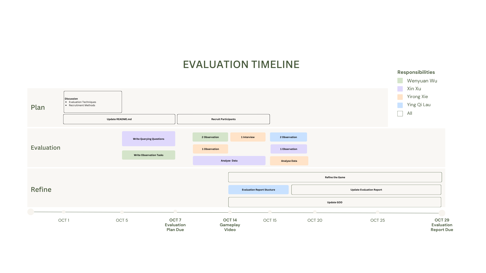

# Faded Soul Game Report

## Table of Contents

- [Evaluation Plan](#evaluation-plan)
- [Evaluation Report](#evaluation-report)
- [Shaders and Special Effects](#shaders-and-special-effects)
- [Summary of Contributions](#summary-of-contributions)
- [References and External Resources](#references-and-external-resources)

## Evaluation Plan
### Evaluation Techniques:
#### Cooperative Evaluation
For our game evaluation, we will employ two techniques: Cooperative Evaluation and Questionnaires. The reason for choosing Cooperative Evaluation is that the game is still in development, and players might find some mechanics confusing. By observing players' interactions with the game, we can collect direct feedback and make adjustments. Participants will be asked to play the game. We will pay closer attention as they perform tasks such as moving, jumping, accelerating, avoiding obstacles, and managing light brightness.

#### Questionnaires 
Questionnaires can gather more quantitative data within limited time constraints. Participants will be asked about their ages, preferred game genres, and gaming frequency. They will use a Likert Scale to evaluate audio and visual effects, the consistency of the overall visual style, and whether it meets aesthetic design standards, ultimately assessing the overall gaming experience. Additionally, we will conduct semi-structured interviews to collect suggestions and feedback on the game, further enriching our evaluation data. 
1. Game frequency and preferred genres.
2. Audio and visual clearness. 
3. Overall visual style (Eerie Theme).
4. Consistency of aesthetics.
5. Overall gameplay experience (1-5).
6. Suggestions for improvements.

### Participants
We plan to invite friends and community members to play and evaluate our game. The evaluation will be conducted both in person and online.

We will set up some criterias ro ensure that our participants are representatives of our game's target audiences. We will target participants ages between 18 to 50 years old, a preference for story-driven games, an appreciation for the eerie theme, familiarity with game controls, and prior gaming experience. 

### Data Collection:
We plan to collect feedback from players in a variety of ways, including instant reactions during the game and post-game questionnaires. We will use the Qualtrics platform to design the questionnaire and collect the data. At the same time, our development team will also observe and record real-time feedback from players in the game to obtain more comprehensive user experience data.

### Data Analysis:
We plan to analyze the collected data using methods such as Affinity Mapping and Thematic Analysis. First, we plan to categorize player feedback, identify common themes or issues, and dig deeper to identify the factors that have a greater impact on the game experience.

We will focus on a few key metrics: player enjoyment, playability, immersion, creativity, and whether there are technical issues or bugs. Through the analysis of these metrics, we can determine how well the game is performing in various aspects. Based on the analysis, we make adjustments such as balancing the difficulty of the game, improving the core game mechanics, optimizing the user interface and user experience, fixing technical bugs, and improving the style of the game based on player feedback.

### Timeline & Responsibilities: 
After group meetings and discussions, we developed a detailed schedule for the development and evaluation of the game, and determined the expected time and responsibility for each process. To ensure that it can be completed smoothly and on time, and to ensure that everyone's contribution is almost equal. See the following figure:

  

Evaluation Timeline

## Evaluation Report
After completing the basic design and development of the game, we recruited 15 participants to help us evaluate it. As planned, we used cooperative evaluation as our primary method, complemented by questionnaires to gather additional feedback and insights from participants for the ongoing iterative optimization of the game.

Based on the feedback from our participants, we received several insights and organized them into specific areas. Here is the summary of our findings and the specific improvements we made:
### Player Enjoyment
Overall, players enjoyed our game concept and the symbolism of the obstacles which represent emotional challenges. However, some of them found certain parts of the game frustrating due to sudden increases in difficulty. 
> "The gaps are too big; I continually faced game over."

Thus, we made changes by adjusting the difficulty level to increase the challenges gradually. For the first level, we kept our terrain flat and simple with no gaps; then we added gaps and dimmed the scene in the following levels. This allows players to get used to the controls and gameplay before facing more complex levels. After evaluation, we also reduce the gap width to make it easier for players to jump over.

> "I died without even knowing what happened—I just entered the game, and suddenly something hit me."

We’ve added notifications (the hints when the diary opens) for unexpected events to help players anticipate what’s coming.

### Playability
Players had some insights about our obstacles. For instance, our participants mentioned that the computer enemy attack angle in CyberScene is too low. 
> "The computer enemy shoots 'comments' at the player, but the attack angle is too low."  
> “Some obstacles appear too unexpectedly; there should be a warning indicator."  
> "The candle positions are too high to reach. "

To address this, we adjusted the attack angles for comments attack in CyberScene, and added warnings for upcoming obstacles in the game. We also repositioned the candle to enable players to reach the spot and activate the light. These changes make the game easier to play.

Some technical issues were reported, such as jumping motion and bugs with certain obstacles.
> “The jumping mechanic looks odd, like they are walking in the mid-air."  
> "The printer attack in AdultScene is too deadly, makes it easy for the player to die."

We solved these issues by fixing the jumping mechanics to make them smoother. Besides, we adjusted the printer attack mechanism from causing game over to reducing speed movement of the player. These adjustments make our game more enjoyable and improve overall playability.

Players noted that gaps are hard to see in the dark game environment. In the cooperative evaluation, 4 out of 5 participants reported they didn't see the gaps, 2 of them suggested they would prefer a visible, dangerous-looking gap or lava to signal them. We added a lava texture and rendered it with a custom distortion shader to create a floating lava effect.

### Technical Performance
Some technical issues were reported, mostly bugs with certain obstacles.
> “The computer is passing through the character."  
> "The pencil box is flying weiredly."

We resolved these issues by adjusting the collision settings and physics properties for these objects.

  

Affinity Map

## Shaders and Special Effects

### Character Dress Shader 

  

This <a href="Assets/Shaders/glowtrans.shader">Glowtrans.shader</a> creates a glowing, animated wave effect on our character's dress. We use different effects, including transparency, Fresnel glow, and wave to add dynamic visuals. It matches our game concept, as our character has disconnected from her past and begins as a blurry figure. The shader uses a combination of vertex and fragment functions. The effects are as follows:
#### Gradient Transparency
- Define the base color and glow textures.
- We use gradientAlpha to control the transparency of the dress from bottom to top.
#### Glow with Fresnel
- The shader creates a soft glow at the edges using a Fresnel effect, brightening the outline.
- We create glow intensity and speed to control the brightness and the glowing speed.
#### Color change
Change the glow color of the skirt over time by using time and sine wave for smooth transition.
#### Wave effect
- We add wave amplitude, frequency, and speed to create a subtle wave effect, moving the dress vertices and letting the skirt move in a flowing motion.
- We set the ranges of middle body height to ensure the wave effect only applies within the skirt 

### Stairs and Lava Shader
This <a href="Assets/Shaders/distortion.shader">Distortion.shader</a>  is used in two areas, to create a lava effect and to simulate a digital world effect around the character. 

  

  

#### Texture Scale
The stairs have varying X scales, which caused the texture to stretch on some of them. It was really obviouse since the texture we use has numbers on it. We set the tiling to auto-adjust based on each object’s scale.

#### Disortion
The distortion function creates wave-like effects in the texture using trigonometric calculations. It was applied only horizontally to keep the effect clear and to prevent dizziness in players. The values vary for each material; for the lava material, we used a slower scroll speed and a higher distortion amount to simulate its flow.

#### Hologram effect 
For the stair shader, an additional hologram effect is applied by adding a semi-transparent texture as a second layer. It creates the effect that the binary numbers and "404" are constantly refreshing.
#### References
- https://docs.unity3d.com/Manual/Shaders.html
- https://docs.unity3d.com/Manual/SL-Blend.html
- https://www.ronja-tutorials.com/post/006-simple-transparency/
- https://www.ronja-tutorials.com/post/012-fresnel/
- https://github.com/feit-comp30019/workshop-8-solution
- https://medium.com/@gonzabarranco/how-to-make-a-hologram-shader-in-unity-with-hlsl-3d6ba415befb

### Portal Particle System

  

  

  

The portal particle system is used to create scene transitions, and this is the one we want to be marked. The system contains two parts, a circle base and a cone top.

#### Portal Base
The circle base has no shape and uses a horizontal billboard render, generating particles outward like a water ripple. The game has two portals, each with different albedo textures to add more dynamism to the overall game design.We added a color curve over time, transitioning from transparent to dark and back to transparent, and also a rotation over time, so the base is like a rotating donut and resembles a portal base more closely.

#### Portal Body
The portal body is cone-shaped, with many broken glass pieces moving from the base to the top. The emission of the glass pieces includes both a rate over time and bursts, allowing players to clearly see the glass without it appearing too stiff. Once the player steps into the portal, the bursts will increase by 100 to create the effect of the glass pieces burying the character.

The glass pieces have trails to create the effect of motion and enhance the sense that the character will be transitioned to another scene. The trail uses the default line material. We changed the width from large to small over time and the color from blue to transparent. So it looks like the glasses are disappearing overtime. 
### Bomb Particle System

  

The bomb particle system triggers an explosion 0.5 seconds after the character passes by, activating only once during that encounter. This effect lasts for 2 seconds, obscuring the character's view of upcoming traps and potentially causing their fall. In the workplace context, the bomb symbolizes hidden dangers and pressures that can suddenly overwhelm individuals.
#### Attributes
- The start sizes of 2 and 3 create a strong visual impact when the bomb explodes, allowing each explosion to vary slightly for a more realistic effect. 
- The lifetimes of 1 and 0.5 seconds control the visibility duration of particles after the explosion, creating a gradual smoke dissipation effect. 
- An emission count of 3 releases three bursts of particles to enhance the sense of an instant explosion. 
- The spherical shape allows particles to radiate in all directions, simulating a realistic blast effect.
#### Utilization of Randomness
- With randomness incorporated, varying lifetime values create a more natural dissipation effect for the explosion smoke, as each particle fades at a different rate. 
- Random emission direction and speed ensure that particles disperse irregularly, enhancing the dynamism and realism of the explosion.
### References
- https://assetstore.unity.com/packages/3d/props/props-3d-221035
- https://www.youtube.com/watch?v=cvQiQglPI18&t=2s

## Summary of Contributions
<table>
  <tr>
    <th style="width: 30%;">Name</th>
    <th style="width: 50%;">Contribution</th>
    <th style="width: 20%;">Percentage</th>
  </tr>
  <tr>
    <td align="center">Yirong Xie</td>
    <td>Game scene building, Find material, Character model, Shader, Particle system, Recording and clip video, Organize meetings, Debug</td>
    <td align="center">25%</td>
  </tr>
  <tr>
    <td align="center">Wenyuan WU</td>
    <td>Game mechanics, Switching levels, Main Menu, Pause menu, Game BGM, Volume adjustment, Particle system, Speed up, Slow down, Debug</td>
    <td align="center">25%</td>
  </tr>
  <tr>
    <td align="center">Ying Qi Lau</td>
    <td>Terrain, gaps, stairs; Shaders; Bucket monster, Icons enemies; Game over panel; Scene decoration; Evaluation report.</td>
    <td align="center">25%</td>
  </tr>
  <tr>
    <td align="center">Xin Xu</td>
    <td>Particle system for bomb and flame; Blood stains and obstacles in the first level; Stacks of documents and printer in the third level; GDD revisions.</td>
    <td align="center">25%</td>
  </tr>
</table>

## References and External Resources

TODO (to be continuously updated) - see specification for details
